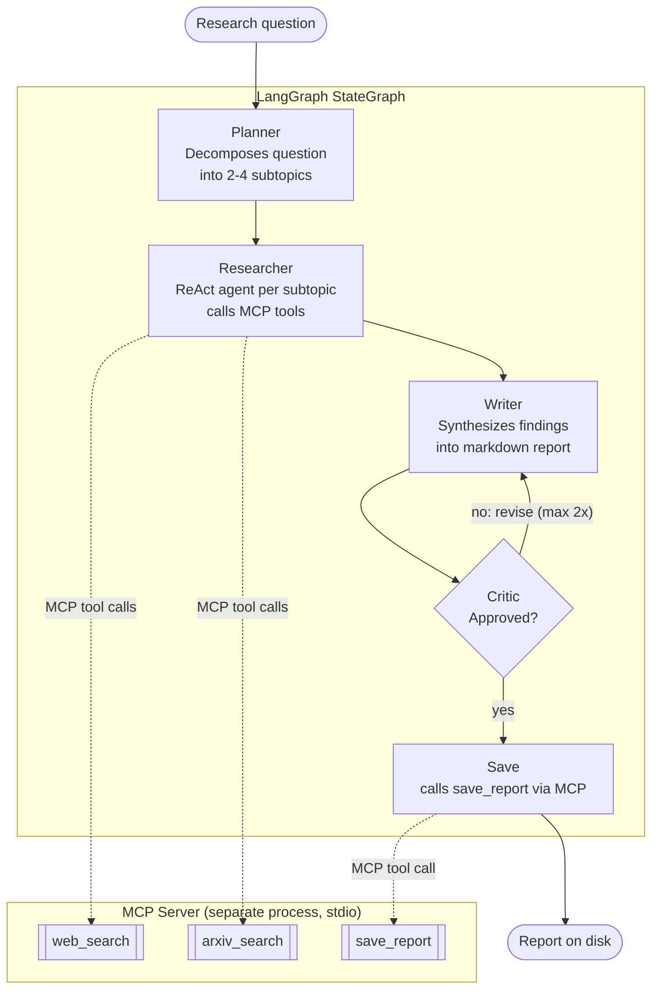

# AI Research Agent

**A multi-agent research assistant built on LangGraph and Model Context Protocol (MCP).**
Give it a question, it plans subtopics, researches each one with live web and arXiv
search delivered over MCP, writes a synthesized report, critiques its own draft,
revises when needed, and saves the final result. Every step is an explicit, inspectable
node in a LangGraph state graph.

[](https://www.python.org/)
[](https://langchain-ai.github.io/langgraph/)
[](https://modelcontextprotocol.io/)
[](LICENSE)

---

## Table of contents

- [Why this design](#why-this-design)
- [Architecture](#architecture)
- [Agents](#agents)
- [Setup](#setup)
- [Usage](#usage)
- [Example output](#example-output)
- [Project layout](#project-layout)
- [Extending this](#extending-this)
- [Notes on running costs](#notes-on-running-costs)
- [License](#license)

## Why this design

Most public "agent" demos are a single LLM in a `while` loop calling a couple of
Python functions decorated as tools. This project deliberately separates two
things that get conflated in those demos:

- **Tool delivery vs. tool logic.** Tools live behind a real MCP server
  (`server/mcp_server.py`), run as a **separate process**, and are discovered by
  the agent at runtime via the MCP handshake — not imported as Python functions.
  This is the same integration pattern you'd use to plug in a third-party MCP
  server (Slack, GitHub, an internal company system) without touching agent code.
- **Orchestration vs. a single agent loop.** Four specialized agents are composed
  as nodes in an explicit LangGraph `StateGraph`, with a genuine conditional
  cycle (critic → writer → critic) — not one agent doing planning, research,
  writing, and review all at once.

## Architecture



`main.py` launches `server/mcp_server.py` as a subprocess and connects to it over
stdio via `langchain-mcp-adapters`. Tool discovery is dynamic — the agent process
has no compile-time knowledge of how `web_search` or `arxiv_search` are implemented.

## Agents

| Agent | Node | Responsibility |
|---|---|---|
| **Planner** | `plan` | Single LLM call that decomposes the research question into 2-4 concrete, non-overlapping subtopics (JSON output). |
| **Researcher** | `research` | A LangGraph prebuilt `create_react_agent` bound to the MCP tools. Runs once per subtopic, calling `web_search` / `arxiv_search` as needed until it has enough to summarize. |
| **Writer** | `write` | Synthesizes all findings (plus any critic feedback on revisions) into a structured markdown report with a sources section. |
| **Critic** | `critique` | Reviews the draft against the original question for completeness, sourcing, and structure. Approves or returns structured feedback. Revisions are capped (`MAX_REVISIONS = 2`) so the graph always terminates. |

## Setup

```bash
git clone https://github.com/<your-username>/research-agent-langgraph-mcp.git
cd research-agent-langgraph-mcp
pip install -r requirements.txt
cp .env.example .env   # add your ANTHROPIC_API_KEY
```

## Usage

```bash
python main.py "How is agentic AI being adopted in telecom OSS/BSS systems?"
```

This will:
1. Launch the MCP server as a subprocess and connect over stdio
2. Print the tools discovered from it
3. Stream progress through `plan -> research -> write -> critique -> (revise?) -> save`
4. Print the final report and write it to `reports/`

## Example output

```
Connected to MCP server. Tools available: ['web_search', 'arxiv_search', 'save_report']

Question: How is agentic AI being adopted in telecom OSS/BSS systems?
============================================================
[plan] Subtopics: ['Agentic AI use cases in OSS/BSS', 'Vendor and telco pilots (2025-2026)', 'Technical integration patterns', 'Risks and adoption barriers']
[research] Gathered 4 findings
[critique] Sent back for revision: Sources section is thin -- add more citations for the vendor pilots claim.
[save] /path/to/reports/20260908_143022_Agentic_AI_in_Telecom_OSS_BSS.md

============================================================
FINAL REPORT
============================================================

# Agentic AI Adoption in Telecom OSS/BSS Systems
...
```

## Project layout

```
research_agent/
├── main.py                 # entrypoint: MCP client + graph runner
├── server/
│   └── mcp_server.py        # MCP server: web_search, arxiv_search, save_report
├── graph/
│   ├── state.py              # shared LangGraph state schema
│   ├── agents.py             # planner / researcher / writer / critic node functions
│   └── build_graph.py        # StateGraph wiring + conditional revise edge
├── requirements.txt
├── .env.example
└── LICENSE
```

## Extending this

- **Swap the MCP server** for a real one (e.g. a company Confluence/Jira MCP
  server) -- only the `MultiServerMCPClient` config in `main.py` changes; no
  agent code changes.
- **Parallelize the researcher** across subtopics with `asyncio.gather`, or
  fan them out as separate LangGraph nodes using `Send`.
- **Add a human-in-the-loop approval node** before `save` using LangGraph's
  `interrupt()` -- a natural fit given the existing critic gate.
- **Swap providers** by changing `MODEL_NAME` / `ChatAnthropic` in
  `graph/agents.py` -- nothing else depends on the provider.

## Notes on running costs

Each run makes several LLM calls (planner, one ReAct loop per subtopic,
writer, critic, possibly a revision round) plus free web/arXiv searches. Keep
`max_results` in the MCP tools small while iterating to control token usage
from search results.

## License

[MIT](LICENSE)
